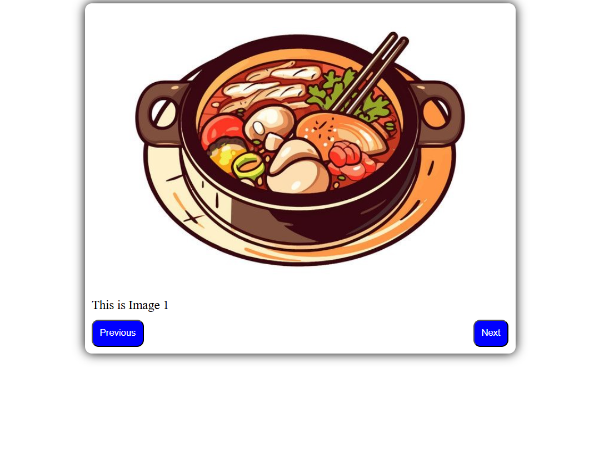

# Ex.08 Design of Interactive Image Gallery
## Date: 17/05/2025

## AIM:
To design a web application for an inteactive image gallery with minimum five images.

## DESIGN STEPS:

### Step 1:
Clone the github repository and create Django admin interface.

### Step 2:
Change settings.py file to allow request from all hosts.

### Step 3:
Use CSS for positioning and styling.

### Step 4:
Write JavaScript program for implementing interactivity.

### Step 5:
Validate the HTML and CSS code.

### Step 6:
Publish the website in the given URL.

## PROGRAM :
```
<html lang="en">
<head>
    <meta charset="UTF-8">
    <meta name="viewport" content="width=device-width, initial-scale=1.0">
    <title>Document</title>
    
    <style>
        .image-gallery{
            position: relative;
            max-width: 600px;
            border-radius: 10px;
            box-shadow: 0 0 15px black;
            margin: auto;
            background-color: white;
            padding: 10px;
        }
        .image{
            width: 100%;
            height: 400px;
            object-fit: cover;
            border-radius: 5px;
        }
        .caption{
            margin-top: 15px;
            font-size: 18px;
        }
        .gallery_button{
            justify-content: space-between;
            display: flex;
            margin-top: 10px;
        }
        button{
            border-radius: 10px;
            background-color: blue;
            color: white;
            padding: 10px;
            cursor: pointer;
           
            transition: 0.3s;
        }
    </style>

</head>
<body>
    <div class="image-gallery">
        
        <div id="caption" class="caption" id="caption">This is Image 1</div>
        <div class="gallery_button">
            <button onclick="prebtn()">Previous</button>
            <button onclick="nextbtn()">Next</button>
        </div>
    </div>
</body>

    <script>
        const images = [
            {src:"img.jpg",caption: "This is Image 1"},
            {src:"img_1.jpg",caption: "This is Image 2"},
            {src:"img_2.jpg",caption: "This is Image 3"},
            {src:"img_3.jpg",caption: "This is Image 4"}
        ]

        index = 0

        function update(){
            document.getElementById("image").src=images[index].src
            document.getElementById("caption").textContent=images[index].caption
        }

        function nextbtn(){
            index = (index +1)%images.length
            update()
        }

        function prebtn(){
            index = (index -1 +images.length)%images.length
            update()
        }
    </script>
</html>
```

## OUTPUT:

## RESULT:
The program for designing an interactive image gallery using HTML, CSS and JavaScript is executed successfully.
